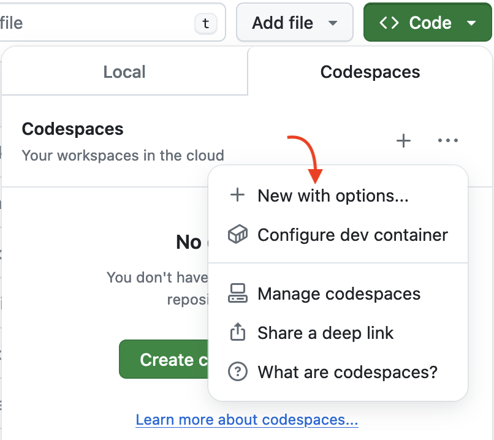
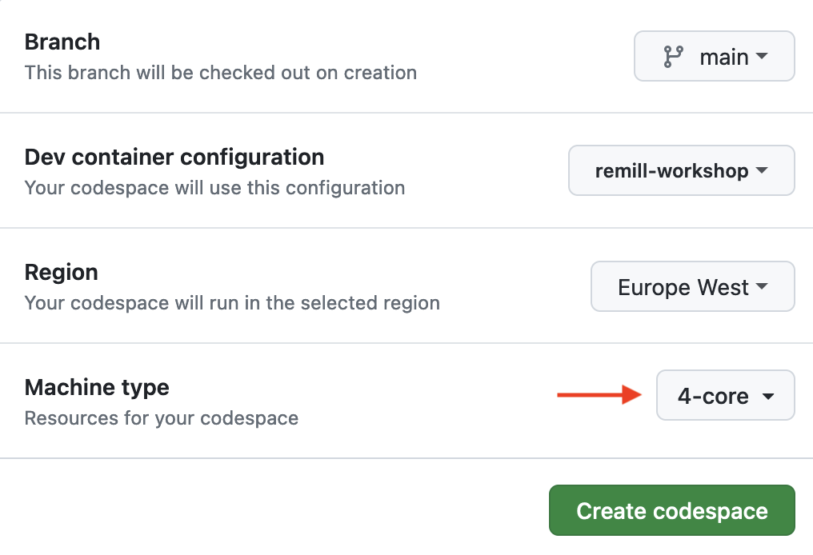
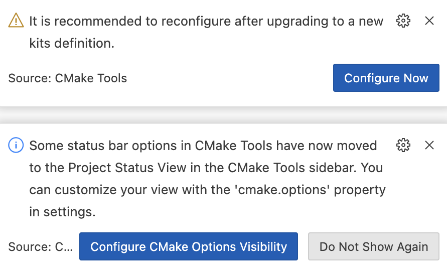

# riscy-business


**Article: [RISC-Y Business: Raging against the reduced machine](https://secret.club/2023/12/24/riscy-business.html).**

## Setting up the environment

This repository uses a [`devcontainer.json`](./.devcontainer/devcontainer.json) file to allow you to quickly get started.

### 1) GitHub Codespaces

**Using Codespaces is required for the training**

1. [Fork this repository](https://github.com/mrexodia/RiscyWorkshop/fork)
2. Click the green `<> Code` button
3. Press `...` and then `New with options...`
4. Change `Machine type` to `4-core`
5. Then `Create codespace`
6. Wait a ~5 minutes while the image is loading ☕
   - Press `Show log` to see progress
   - Reload the page if it appears stuck
   - **Firefox does not work, use Chrome!**

|  |  |
|---|---|

#### **Remember to shut down your codespace [here](https://github.com/codespaces) when you're finished.**

I recommend switching to the `GitHub Dark` theme, because the syntax highlighting works better there.

When prompted by the CMake tools, just close the notifications:



<details>

<summary><sub>At a later date you can set things up locally with Docker Desktop</sub></summary>

### Docker Desktop (tricky)

- Install/Update [Docker Desktop](https://www.docker.com/products/docker-desktop/) ([alternatives](https://code.visualstudio.com/remote/advancedcontainers/docker-options))
- **Start Docker Desktop**
- Install [Visual Studio Code](https://code.visualstudio.com)
- Clone and open this repository in VS Code (**use the HTTPS protocol**)
- Install the [Dev Containers](vscode:extension/ms-vscode-remote.remote-containers) extension in VS Code (you should be prompted for recommended extensions)
- Click the blue 'Reopen in Container' button when prompted (you can also find it in the command palette)

For more detailed steps, check out the [Dev Containers tutorial](https://code.visualstudio.com/docs/devcontainers/tutorial). The instructions after this assume you are running _inside_ the container.

#### Windows

Because the host filesystem is mounted inside the container you _may_ need to configure Git to not automatically convert line endings:

```sh
git config --global core.autocrlf false
```

Additionally it's recommended to configure Docker to use the WSL 2 backend.

</details>
